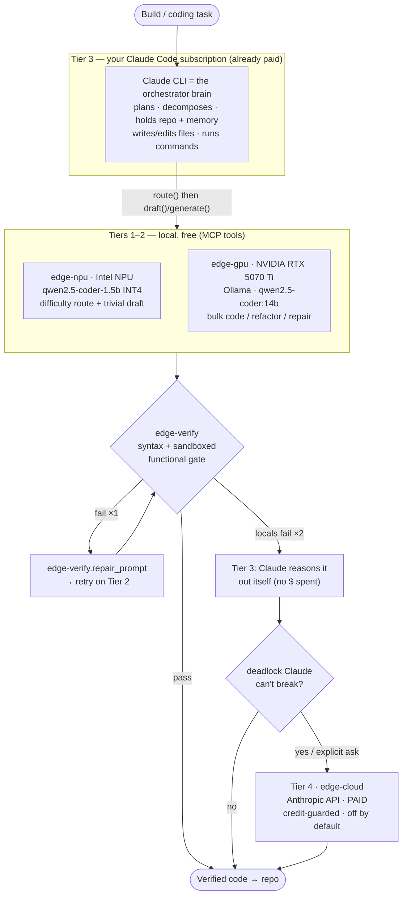

# edge-cascade

[](https://github.com/danthemanvsqz/Edge-Cascade/actions/workflows/ci.yml)
[](https://github.com/danthemanvsqz/Edge-Cascade/actions/workflows/ci.yml)
[-yellow.svg)](https://github.com/danthemanvsqz/Edge-Cascade/actions/workflows/ci.yml)

[](LICENSE)


A local-first inference mesh for an Intel Core Ultra + NVIDIA laptop. The
headline interface is **not a script you call** — it's **Claude Code itself**,
running as Tier 3 of a 4-tier cascade and driving the local accelerators as
MCP tools. The expensive metered API is the last resort, not the default, so
your subscription stretches across long build sessions and real dollars stay
near zero.



> Local-first, max savings: every delegable sub-task goes to the cheapest
> sufficient tier; every local answer is gated by an objective verifier; Claude
> only reasons directly when the locals fail; the paid API fires only when even
> Claude is stuck. The full policy is in [`CLAUDE.md`](CLAUDE.md).

## The 4 tiers

| Tier | What | Engine | Marginal cost |
|------|------|--------|---------------|
| 1 | Intel NPU (AI Boost), iGPU fallback — `edge-npu` | OpenVINO GenAI · `qwen2.5-coder-1.5b` sym-INT4 | ~free (single-digit watts) |
| 2 | NVIDIA RTX 5070 Ti — `edge-gpu` | Ollama · `qwen2.5-coder:14b` | free local tokens |
| 3 | **The Claude CLI session = you, reading this** | Claude Code (your **subscription**) | already paid — the default brain |
| — | Deterministic gate — `edge-verify` | Intel CPU, **no model** | free (AST + sandboxed exec) |
| 4 | Anthropic API — `edge-cloud` | `claude-sonnet-4-6`, credit-guarded | **metered $ — genuine last resort** |

The key distinction the design enforces: **Tier 3 (CLI-Claude, subscription)
and Tier 4 (API-Claude, metered) are different tiers.** When the locals can't
deliver, Claude reasons it out *itself* before ever spending API money.

> The NPU only runs models exported with the NPU recipe
> (`--weight-format int4 --sym --ratio 1.0 --group-size=-1`). The stock
> `*-int4-ov` exports crash the vpux compiler; the probe falls back to the iGPU.

## Why route Tier 1 to the NPU?

Tier 1 is the *hot path* — it runs on **every** prompt (difficulty routing + the
trivial-draft attempt). Putting that always-on work on the NPU instead of the
discrete GPU pays off several ways:

- **Battery life.** This is the headline. The Intel AI Boost NPU does sustained
  inference in the **single-digit watts**, while waking the RTX 5070 Ti laptop
  GPU for the same small job pulls **tens of watts** (and the dGPU's idle/active
  power-state swings are themselves costly). Keeping the dGPU asleep for routing
  and easy prompts is a large, measurable extension of unplugged runtime.
- **Thermals & noise.** NPU inference stays fanless and cool; routing every
  prompt through the dGPU spins fans and heats the chassis — bad for a laptop.
- **The dGPU stays free.** The 14B model needs ~9 GB of VRAM and full GPU
  compute. Pinning the cheap tier to the NPU means the RTX is untouched and
  available for Tier-2 escalations, training, games, or other CUDA work —
  better total system utilization (the NPU would otherwise sit idle).
- **No spin-up tax on the common case.** The NPU pipeline loads once and stays
  resident, so short router/draft calls avoid repeated dGPU power-state and
  context-load latency.
- **Effectively free.** Local **and** low-power: the always-on routing layer
  costs ~0 dollars and ~0 meaningful energy, which is exactly what makes a
  local-first cascade economical.

**Honest caveat:** the NPU is *not* faster per token than the 14B model on the
dGPU — its small 1.5B model is also lower quality. The NPU's value is
**perf-per-watt and offload**, not raw speed. That's why the design only trusts
it for routing and trivial drafts, with the verifier gating every answer and
escalating to the GPU/cloud when it isn't good enough.

**Surprisingly capable in practice.** For a 1.5B model on the NPU it punched
above its weight during testing: it produced a correct, **stable** merge sort
that passed the property-based `sorts_like` check (random/duplicate/empty
inputs), and it responded reasonably to the repair protocol — given a failing
assertion it fixed a buggy function in one round. It won't match the 14B model
on harder tasks, but the cheap tier resolves more prompts on its own than the
"1.5B" label suggests — which makes the local-first routing pay off more often.

## What's in here

**The agentic flow (primary):**

- **`scripts/edge-cli.ps1`** — the launcher. Ensures the venv extras, generates
  a machine-correct local MCP config, and starts Claude Code with
  `--mcp-config <that> --strict-mcp-config` so the session sees exactly the
  local mesh. `edge-cloud` (paid Tier 4) is **excluded by default** — the
  session is structurally unable to spend until you pass `-WithCloud`. It also
  injects the `CLAUDE.md` delegation policy via `--append-system-prompt`, so
  the policy travels with the session **regardless of which directory you build
  in** (the session launches in your project dir, where `CLAUDE.md` would not
  otherwise be auto-discovered, and `--add-dir` grants file access, not policy).
- **`mcp_servers/`** — the tiers as MCP tools: `edge-npu` (`route`, `draft`,
  `status`), `edge-gpu` (`generate`, `status`), `edge-verify` (`verify_syntax`,
  `verify_functional`, `repair_prompt`), `edge-cloud` (`budget`, `escalate`).
- **`CLAUDE.md`** — the delegation policy the orchestrator follows, plus the
  `routing_dispatch` protocol.
- **`/edge-cascade`** skill — route one task through the mesh on demand once
  the MCP servers are connected (see `ARCHITECTURE.md §7`).
- **`/experiment`** skill — design and run a LOCAL ($0) benchmark, ablation, or
  creative cross-tier study (e.g. an NPU-vs-GPU **persona debate**). Invoke as
  `/experiment <idea>`; it **enters plan mode first** — designing the run
  (evidence branch, trial budget, Bayesian analysis, telemetry lane) and waiting
  for your approval before it touches a model — then executes on a labeled
  evidence branch. See `.claude/skills/experiment/SKILL.md`.

**Observability (read-only over the recorder — not chat narration):**

Every MCP tool call and every `cli.py` task appends one deterministic record
(`cascade/logfmt.py`) to `runs/*.rec`, each carrying a `ts` + per-process
`run_id`. Both tools below are pure consumers of that stream — the auditable
ground truth the RUNBOOK honesty rule requires.

- **`replay.py`** — reconstructs the true ordered timeline. Merges the five
  streams, sorts by wall-clock `ts`, splits into **episodes** (idle-gap
  heuristic; each `cascade.rec` task is an exact, isolated boundary), and
  prints the real hop sequence: `route → draft → verify → repair_prompt →
  gpu.generate → …`. Flags: `--last N`, `--run <id>`, `--server <name>`,
  `--failures-only`, `--gap <s>`, `--json`. Records written before the
  `ts`/`run_id` change degrade to a clearly-marked "legacy" episode.
- **`dashboard.py`** — a self-refreshing terminal health view (stdlib ANSI
  redraw, default 2 s; `--once`/`--json` for a snapshot): per-server liveness
  + latency percentiles, draft-truncation rate, gate failures, escalations,
  and the headline **spend invariant** — `edge-cloud` calls + $ must read
  `$0.00`, rendered RED the instant they do not.

**Standalone cascade (legacy / demo — stateless, single-shot):**

- **`cli.py`** — the original NPU→GPU→cloud cascade with a live tee log
  (`runs/cascade.log`). One prompt, one answer; no memory or file/exec — fine
  for a quick local Q&A, not for building projects.
- **`lookahead.py`** — request-level speculative look-ahead with a trust window.
- **`validate_log.py`** — extracts code from logs and validates it with a tiny
  **DSL** (`checks.dsl`); `--repair` feeds failures back to a model.
- **`vs.py` / `webchat.py`** — NPU-vs-GPU side-by-side, terminal or web page.

## Setup (uv)

```bash
uv sync                              # core deps + dev tools (fast; no ML stack)
uv sync --extra accel --extra mcp    # NPU/iGPU stack + MCP servers (required for the flow)
```

> Sync **both** extras together. `uv sync --extra accel` *alone* removes the
> `mcp` package (and vice-versa) — the launcher re-syncs both for you.

The paid Tier 4 needs `ANTHROPIC_API_KEY` in a local `.env` (git-ignored — see
below). It is bounded by the credit guard (`CASCADE_CLOUD_MAX_CALLS`, default 3;
`CASCADE_CLOUD_USD`, default 0.50, per run) **and** excluded from the launcher
unless you opt in.

## Run

**Agentic flow (recommended).** From any directory you want to build in:

```powershell
# Windows PowerShell 5.1 (no `pwsh`? use `powershell`; PS7 users can use `pwsh`):
powershell -ExecutionPolicy Bypass -File scripts\edge-cli.ps1                    # build here, local mesh only
powershell -ExecutionPolicy Bypass -File scripts\edge-cli.ps1 -ProjectDir C:\src\myapp
powershell -ExecutionPolicy Bypass -File scripts\edge-cli.ps1 -Check             # validate wiring, don't launch
powershell -ExecutionPolicy Bypass -File scripts\edge-cli.ps1 -WithCloud         # also wire paid Tier 4 (opt-in)
```

This opens a Claude Code session that **is Tier 3** — it drives `edge-npu` /
`edge-gpu` for the bulk work, gates with `edge-verify`, reasons hard parts
itself, and never touches the paid API (unless `-WithCloud`).

### Using it — and confirming it actually delegated

1. **Check the wiring.** In the new session run `/mcp`. Expect exactly three,
   all `✔ connected`: `edge-npu` (3 tools), `edge-gpu` (2), `edge-verify` (3),
   and **no `edge-cloud`**. ("connected" means the server process answered — the
   NPU itself compiles lazily on the first `route`/`draft` call, a one-time
   ~12 s pause, not a hang.) Press `Esc` to exit the menu.
2. **Give it a coding task**, e.g. *"write a Python function that merges two
   sorted lists"*. It emits a `routing_dispatch` block, calls `edge-npu.route`
   → `edge-npu.draft`, gates the draft with `edge-verify`, and only escalates
   to `edge-gpu` (or reasons it out itself) if the gate fails.
3. **Verify it didn't just fake it.** Every tool call is recorded to
   `runs/<server>.rec`. After a task, a fresh `runs/edge-npu.rec` /
   `runs/edge-verify.rec` (and a *stale* `edge-gpu.rec` / `edge-cloud.rec` for
   work that stayed local) is independent proof of which silicon actually ran —
   the recorder can't be talked into lying the way a chat reply can.

> **Verified end-to-end (2026-05-18).** The merge-two-sorted-lists task above
> ran entirely on Tier 1: `edge-npu.route` + `draft`, `edge-verify` syntax +
> functional gate, **zero** `edge-gpu` / `edge-cloud` calls — confirmed against
> the `.rec` recorder, not just the transcript. The policy also correctly
> overrode the 1.5B router over-rating the prompt's difficulty, staying on the
> cheap tier instead of escalating. The escalation/repair path
> (gate-fail → NPU→GPU climb → `repair_prompt` loop) is the next thing to
> harden.

**Standalone cascade (demo).**

```bash
uv run python cli.py "write a binary search in python"
uv run python lookahead.py            # built-in task stream
uv run python validate_log.py --repair
uv run python vs.py                   # terminal side-by-side
```

## Secrets

**Never commit secrets.** `.env` and `*.key` are in `.gitignore`; the code
reads `ANTHROPIC_API_KEY` only from the environment / `.env`, never source.
If a key is ever pasted or leaked, rotate it at
<https://console.anthropic.com/settings/keys>.

## Tests & coverage policy

```bash
uv run pytest
```

> **CI** runs this exact suite *and* the bandit security gate on every push
> and PR (`.github/workflows/ci.yml`, Windows runner). The bandit gate is
> **loose by design** — edge-cascade is a local, sandboxed, single-user runtime,
> so it blocks only on *egregious* findings (HIGH severity **and** HIGH
> confidence); everything else is reported, not gated. A green **CI** badge
> means the scoped 100% coverage gate held and bandit found no egregious issues.

The suite enforces **`fail_under = 100`** — but *scoped*, not project-wide.
100% is measured over the pure, safety-critical logic:

- `cascade/config.py` — env/config + the cloud gate
- `cascade/feedback.py` — the repair protocol
- `cascade/verifier.py` — the escalation gate
- `cascade/cloud_worker.py` — credit-guard cost math + cloud gating

Excluded from the gate (see `pyproject.toml [tool.coverage.run] omit`):
`npu_worker`, `gpu_worker`, `orchestrator`, `lookahead`, and the CLI/server
entrypoints. These require real NPU hardware, a running Ollama, the paid API,
or a `__main__`/HTTP loop. Mock-theater tests for them would assert against
fakes, adding maintenance risk without real assurance. They're exercised by
the live smoke runs instead. Tightening this (with hardware fakes) is a
deliberate future choice, not an accident — hence the explicit `omit`.

## License

[MIT](LICENSE) © 2026 Edge Cascade contributors. Use it, fork it, ship it —
no strings attached beyond keeping the license notice.
