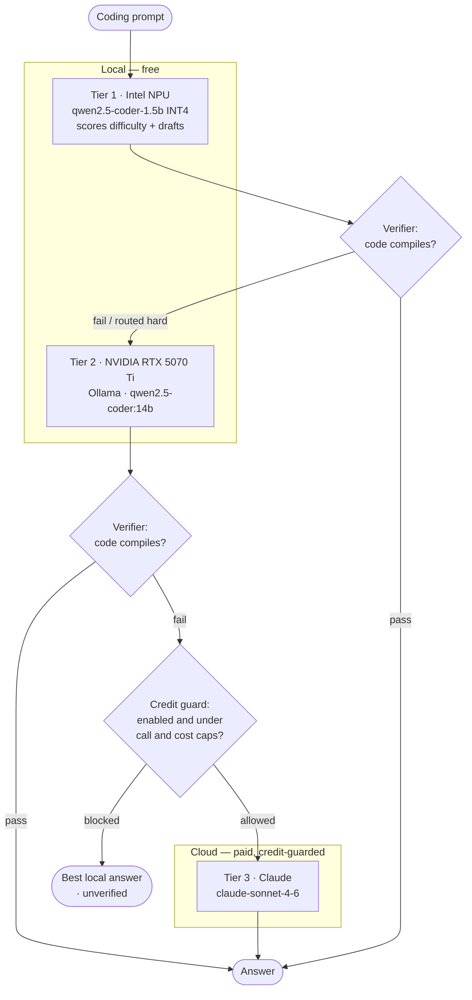

# edge-cascade


A multi-accelerator inference cascade for an Intel Core Ultra + NVIDIA laptop.
It routes coding prompts across **Intel NPU → NVIDIA GPU → Claude cloud**,
gating every hop on an objective code verifier and only spending money when
the free local tiers provably can't deliver.



> The cascade is local-first: the NPU routes by difficulty and most prompts
> never leave the machine. The paid tier is reached only on a verifier failure
> *and* when the credit guard allows it.

## Hardware tiers

| Tier | Device | Backend | Model |
|------|--------|---------|-------|
| 1 | Intel NPU (AI Boost), iGPU fallback | OpenVINO GenAI | `qwen2.5-coder-1.5b` (sym INT4) |
| 2 | NVIDIA RTX 5070 Ti | Ollama | `qwen2.5-coder:14b` |
| 3 | Cloud (**paid, off by default**) | Anthropic API | `claude-sonnet-4-6` |

> The NPU only runs models exported with the NPU recipe
> (`--weight-format int4 --sym --ratio 1.0 --group-size=-1`). The stock
> `*-int4-ov` exports crash the vpux compiler; the probe falls back to the iGPU.

## Why route Tier 1 to the NPU?

Tier 1 is the *hot path* — it runs on **every** prompt (difficulty routing + the
trivial-draft attempt). Putting that always-on work on the NPU instead of the
discrete GPU pays off several ways:

- **Battery life.** This is the headline. The Intel AI Boost NPU does sustained
  inference in the **single-digit watts**, while waking the RTX 5070 Ti laptop
  GPU for the same small job pulls **tens of watts** (and the dGPU's idle/active
  power-state swings are themselves costly). Keeping the dGPU asleep for routing
  and easy prompts is a large, measurable extension of unplugged runtime.
- **Thermals & noise.** NPU inference stays fanless and cool; routing every
  prompt through the dGPU spins fans and heats the chassis — bad for a laptop.
- **The dGPU stays free.** The 14B model needs ~9 GB of VRAM and full GPU
  compute. Pinning the cheap tier to the NPU means the RTX is untouched and
  available for Tier-2 escalations, training, games, or other CUDA work —
  better total system utilization (the NPU would otherwise sit idle).
- **No spin-up tax on the common case.** The NPU pipeline loads once and stays
  resident, so short router/draft calls avoid repeated dGPU power-state and
  context-load latency.
- **Effectively free.** Local **and** low-power: the always-on routing layer
  costs ~0 dollars and ~0 meaningful energy, which is exactly what makes a
  local-first cascade economical.

**Honest caveat:** the NPU is *not* faster per token than the 14B model on the
dGPU — its small 1.5B model is also lower quality. The NPU's value is
**perf-per-watt and offload**, not raw speed. That's why the design only trusts
it for routing and trivial drafts, with the verifier gating every answer and
escalating to the GPU/cloud when it isn't good enough.

**Surprisingly capable in practice.** For a 1.5B model on the NPU it punched
above its weight during testing: it produced a correct, **stable** merge sort
that passed the property-based `sorts_like` check (random/duplicate/empty
inputs), and it responded reasonably to the repair protocol — given a failing
assertion it fixed a buggy function in one round. It won't match the 14B model
on harder tasks, but the cheap tier resolves more prompts on its own than the
"1.5B" label suggests — which makes the local-first routing pay off more often.

## What's in here

- **`cli.py`** — the 3-tier cascade: NPU router/draft → GPU → cloud, verifier-gated, with a live tee log (`runs/cascade.log`).
- **`lookahead.py`** — request-level speculative look-ahead: the NPU answers, earns a *trust window* by agreeing with the GPU, then runs solo; verifier-gated cloud escalation behind a **credit guard**.
- **`validate_log.py`** — extracts code from logs and validates it with a tiny **DSL** (`checks.dsl`); `--repair` feeds failures back to a model (`--repair-tier gpu|npu`) via the structured protocol in `cascade/feedback.py`.
- **`vs.py` / `webchat.py`** — NPU-vs-GPU side-by-side, in the terminal or a local web page.

## Setup (uv)

```bash
uv sync                 # core deps + dev tools (fast; no ML stack)
uv sync --extra accel   # add the Intel NPU/iGPU stack (OpenVINO GenAI) — large
```

The cloud tier needs `ANTHROPIC_API_KEY`. Put it in a local `.env`
(git-ignored — see below). It stays **off** unless you pass `--cloud` /
`enable_cloud=True` / `CASCADE_ENABLE_CLOUD=1`, and is further bounded by the
credit guard (`CASCADE_CLOUD_MAX_CALLS`, default 3; `CASCADE_CLOUD_USD`,
default 0.50, per run).

## Run

```bash
uv run python cli.py "write a binary search in python"
uv run python lookahead.py            # built-in task stream
uv run python validate_log.py --repair
uv run python vs.py                   # terminal side-by-side
```

## Secrets

**Never commit secrets.** `.env` and `*.key` are in `.gitignore`; the code
reads `ANTHROPIC_API_KEY` only from the environment / `.env`, never source.
If a key is ever pasted or leaked, rotate it at
<https://console.anthropic.com/settings/keys>.

## Tests & coverage policy

```bash
uv run pytest
```

The suite enforces **`fail_under = 100`** — but *scoped*, not project-wide.
100% is measured over the pure, safety-critical logic:

- `cascade/config.py` — env/config + the cloud gate
- `cascade/feedback.py` — the repair protocol
- `cascade/verifier.py` — the escalation gate
- `cascade/cloud_worker.py` — credit-guard cost math + cloud gating

Excluded from the gate (see `pyproject.toml [tool.coverage.run] omit`):
`npu_worker`, `gpu_worker`, `orchestrator`, `lookahead`, and the CLI/server
entrypoints. These require real NPU hardware, a running Ollama, the paid API,
or a `__main__`/HTTP loop. Mock-theater tests for them would assert against
fakes, adding maintenance risk without real assurance. They're exercised by
the live smoke runs instead. Tightening this (with hardware fakes) is a
deliberate future choice, not an accident — hence the explicit `omit`.
